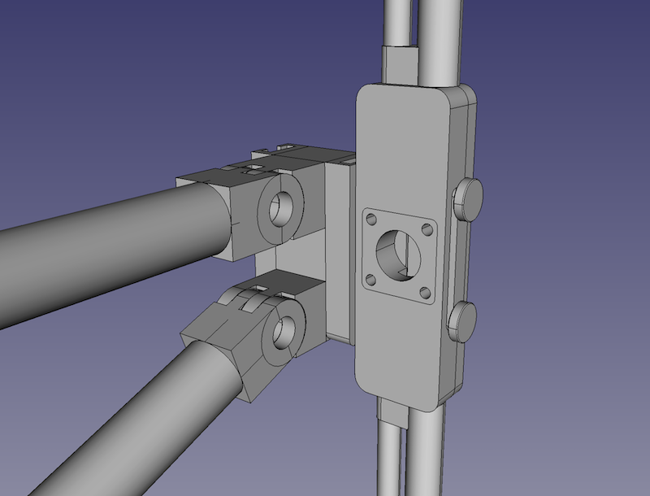

# dipole-antenna
A 3D printed antenna for dual-band (2-meter / 70-centimeter) use.

> NOTE: This documentation is a work-in progress.  Part names, descriptions, and photographs are all subject to change.

## Description
- As designed:
    - 
- Reality:
    - 

- Details
    - SO-239 connection point
        - 
    - Wall mount affixed to the railing mounts instead
        - 
    - Railing mounts
        - 

## Parts
- antenna-sheath
    - 
    - Designed to strengthen the antenna elements as well as shield inclement weather
- holder-bottom
    - 
    - Bottom section of the element holder, onto which the SO-239 connector is affixed, the antenna elements are bent, pushed, and glued into their channels, and wire leads are run from the SO-239 connector's center conductor and surrounding ground to one side each
- holder-top
    - 
    - Top section of the element holder whose main purpose is to keep everything held inside
- railing-adapter-upper
    - 
    - This wraps around the horizontal handrail of my balcony's railing and has a single screw hole into which the _wall-attachment_ piece is attached
- railing-adapters-lower
    - 
    - This wraps around a vertical segment of my balcony's railing and serves to help keep the entire setup vertically oriented in addition to being an extra point to which the _wall-attachment_ piece is secured for redundancy
- completed-dipole-with-mount
    - The fullly-assembled model mounted to the railing (see above project photos)

### Components
- attachment-slot
    - Rail piece into which the dipole element holder slots into
- element-holder
    - First-pass at the main part of the structure into which the antenna elements would be press-fit
- railing
    - Mock-up of the railing off of my apartment's balcony
- so239
    - Standalone piece into which an SO-239 connector can be attached with screws

### Tests
- railing-adapter-test-fit-part
    - A thin slice of plastic to be test-fit around the balcony railing to ensure proper measurements had been made

### wall-holder

- antenna-slot
    - The piece at the end of the arms consisting of two attachment slots
- arms
    - Two arms to connect the _wall-attachment_ piece to the _antenna-slot_ piece
- complete-attachment
    - All pieces put together (see photo above)
- pins
    - Printed pins to be used at the center of the pivots (not pictured above)
- pivots-a-b
    - Basic design of the pivots
- wall-attachment
    - The large piece mounted to an external wall to which the arms connect
